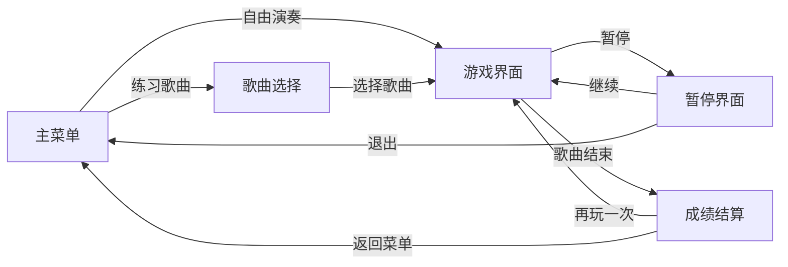

<div align="center">

# Piano Hero

### 在浏览器里弹奏你的音乐梦想

[](https://mrfeixiang.github.io/piano-hero/)
[]()
[]()
[]()

</div>

---

## 项目简介

**Piano Hero** 是一款灵感来源于经典音乐游戏 *Guitar Hero* 的浏览器钢琴游戏。彩色的音符从屏幕顶部飘落，当它们到达底部的判定区域时，你需要在恰当的时机按下对应的键盘按键来演奏旋律、赢取分数。

无需安装任何软件，打开浏览器即可畅玩。纯前端实现，零依赖，轻量而有趣。

---

## 游戏亮点

### 自由演奏模式

> 没有乐谱的束缚，随心所欲地弹奏。

在自由演奏模式下，你可以随意按键，探索不同的音符组合，感受钢琴的魅力。适合热身练习或纯粹的即兴创作。

### 歌曲练习模式

> 跟着经典旋律，一个音符一个音符地练习。

内置多首耳熟能详的经典曲目：

| 曲目 | 难度 | 描述 |
|:---|:---:|:---|
| Twinkle Twinkle Little Star | Easy | 经典儿歌《小星星》，入门必练 |
| Mary Had a Little Lamb | Easy | 简单欢快的练习曲 |
| Ode to Joy | Medium | 贝多芬《欢乐颂》，旋律优美 |
| Happy Birthday | Easy | 生日快乐歌，节奏轻松 |
| Jingle Bells | Medium | 经典圣诞旋律 |

### 精准判定与连击系统

游戏采用精确的时间判定机制：

```
              完美判定窗口
          |<--- ±55ms --->|
    ──────|───────●───────|──────  音符到达判定线
          |               |
     |<------- ±130ms ------->|
           良好判定窗口
```

- **PERFECT** — 在 ±55ms 内精准击中，金色特效闪耀
- **GOOD** — 在 ±130ms 内击中，绿色反馈提示
- **MISS** — 错过了节拍，红色警示，连击中断

连续命中会累积 **Combo 连击**，连击数越高，得分倍率越大！

### 实时音频合成

每个音符都通过 **Web Audio API** 实时生成，无需加载任何音频文件。从 C4 到 C5 的完整八度音阶，包含全部黑键（升半音），共 13 个音符。

---

## 操作指南

游戏使用键盘中间一排按键操控，布局模拟真实钢琴键盘：

### 白键（自然音）

```
┌─────┬─────┬─────┬─────┬─────┬─────┬─────┬─────┐
│     │     │     │     │     │     │     │     │
│  A  │  S  │  D  │  F  │  G  │  H  │  J  │  K  │
│     │     │     │     │     │     │     │     │
│ C4  │ D4  │ E4  │ F4  │ G4  │ A4  │ B4  │ C5  │
└─────┴─────┴─────┴─────┴─────┴─────┴─────┴─────┘
```

### 黑键（升半音）

```
  ┌───┐ ┌───┐       ┌───┐ ┌───┐ ┌───┐
  │ W │ │ E │       │ T │ │ Y │ │ U │
  │C#4│ │D#4│       │F#4│ │G#4│ │A#4│
  └───┘ └───┘       └───┘ └───┘ └───┘
```

> 提示：黑键的排列与真实钢琴完全一致 — E 与 F 之间、B 与 C 之间没有黑键。

---

## 游戏界面

### 整体架构

```
┌──────────────────────────────────────────────┐
│                  HUD 状态栏                    │
│  Score: 1280        Free Play      ⏸ Pause   │
│  Combo: 5x                                    │
├──────────────────────────────────────────────┤
│                                              │
│           ♪        ♪                         │
│     ♪              ♪         ♪               │
│              ♪                    ♪          │
│                         ♪                    │
│        ♪         ♪              ♪            │
│                                              │
│  音符下落区域（Note Highway）                  │
│                                              │
│──────────── 判定线 ─────────────────────────── │
├──────────────────────────────────────────────┤
│  ┌──┬──┬──┬──┬──┬──┬──┬──┐                   │
│  │C │D │E │F │G │A │B │C │  虚拟钢琴键盘      │
│  └──┴──┴──┴──┴──┴──┴──┴──┘                   │
└──────────────────────────────────────────────┘
```

游戏界面分为三层：
1. **HUD 状态栏** — 显示当前分数、连击数、歌曲名称和暂停按钮
2. **音符下落区域** — 彩色音符从上方飘落，每个音符都有独特的颜色标识
3. **虚拟钢琴键盘** — 底部的钢琴键盘会在你按键时高亮，给予直观的视觉反馈

### 五大界面流转



---

## 音符配色方案

每个音符都有专属的霓虹色彩，在深色背景上格外醒目：

| 音符 | 颜色 | 色值 | 视觉效果 |
|:---:|:---|:---|:---|
| C4 | 红色 | `#ff4444` | 热情似火的起始音 |
| D4 | 橙色 | `#ff8800` | 温暖明亮 |
| E4 | 黄色 | `#ffdd00` | 阳光灿烂 |
| F4 | 黄绿 | `#88ff00` | 清新自然 |
| G4 | 青色 | `#00ffcc` | 清澈通透 |
| A4 | 蓝色 | `#0088ff` | 深邃宁静 |
| B4 | 紫色 | `#8844ff` | 神秘高贵 |
| C5 | 粉色 | `#ff44aa` | 浪漫收尾 |

---

## 评分系统

歌曲结束后，根据你的表现给出评级：

```
    ★★★★★          ★★★★           ★★★           ★★            ★
      S              A              B             C             D
    传奇           优秀            良好           及格          加油
```

结算界面会展示：
- **最终得分** — 所有命中得分的总和
- **最高连击** — 本局最长不间断连击数
- **判定统计** — Perfect / Good / Miss 各多少次
- **历史最佳** — 如果刷新了最高分，会出现金色的 "New Best!" 标识

---

## 技术实现

### 技术栈

本项目采用纯原生前端技术，零框架零依赖：

```
Piano Hero
├── index.html    # 页面结构与五大界面
├── piano.css     # 深色霓虹风格样式
└── piano.js      # 游戏核心逻辑
```

### 核心技术点

- **Web Audio API** — 通过 `OscillatorNode` 实时合成钢琴音色，无需预加载音频文件
- **requestAnimationFrame** — 60fps 流畅的音符下落动画
- **CSS 变量** — 统一管理 13 种音符颜色主题
- **时间精确判定** — 基于毫秒级时间差的 Perfect/Good/Miss 判定
- **LocalStorage** — 持久化存储每首歌的最高分记录

---

## 快速开始

1. **在线畅玩** — 直接访问 [Live Demo](https://mrfeixiang.github.io/piano-hero/)

2. **本地运行**
   ```bash
   git clone https://github.com/mrfeixiang/piano-hero.git
   cd piano-hero
   # 用任意方式启动本地服务器，例如：
   python3 -m http.server 8000
   ```
   然后在浏览器打开 `http://localhost:8000`

---

<div align="center">

*用键盘弹奏旋律，在浏览器中成为钢琴英雄。*

</div>
